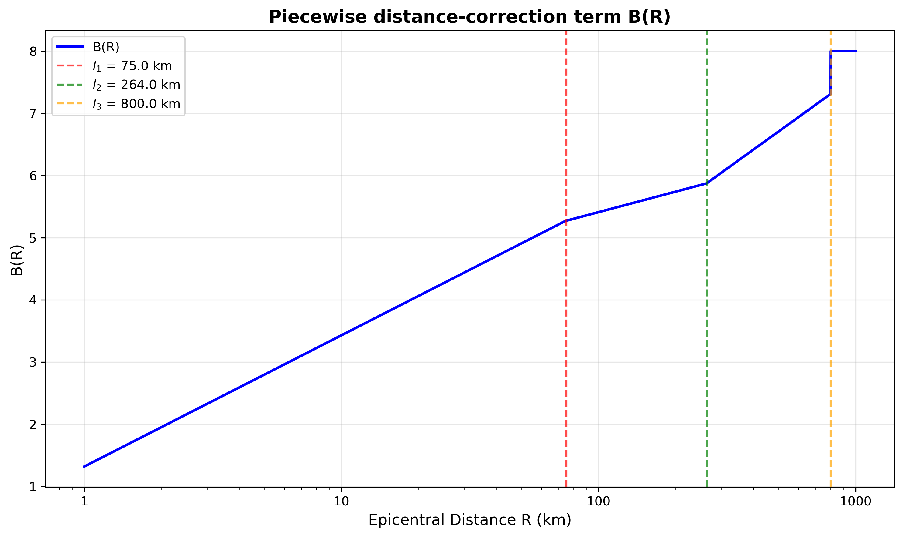

# K_Class Magnitude Plugin for SeisComP

This plugin provides a custom magnitude calculation for SeisComP, known as Class (or "Klass"), which is traditionally used in seismological practice in several countries.

---

## Disclaimer

This plugin is provided "as is" and is the result of an ongoing development and learning effort. It may contain bugs, errors, or inaccuracies.

No warranty of any kind is provided, express or implied. The user assumes all responsibility and risk for the use of this software. Thorough testing is strongly advised before deploying it in a production environment.

---

## Acknowledgments

Many thanks to everyone who helped along this journey! I wanted to specifically mention:

* **Ruslan Diagilev** for helping with the scientific part: providing a robust information about K_Class nature;
* **Dirk Rößler** for spotting unnesessary complications during the SeisComP user group meeting and productive talks;
* **Peter Evans** for code reviewing and inspiration to continue and push forward;
* **ADD MORE**

**Multiple people from open source community**

The development of this plugin was heavily inspired by and adapted from the `MagnitudeProcessor_ML` (MLh) plugin, originally developed by the **Swiss Seismological Service (ETHZ/SED)**.

Significant portions of the class structure, configuration file handling, and processing logic are based on their work. The original authors are gratefully acknowledged for providing a robust and clear foundation that made this implementation possible.

---

## Developer Note: API Compatibility

This plugin has a known incompatibility between SeisComP API versions

* **SeisComP 6.X:** The `setDefaults()` virtual function **does not exist** in the `Processing::MagnitudeProcessor` base class. To compile this plugin for SeisComP 6, you **must delete or comment out** the entire `setDefaults()` function in the `MagnitudeProcessor_K_Class` class.
targetComponent() should be replaced to _usedComponent.

The plugin will fail to compile on SeisComP 6 if the `setDefaults()` function is present.

## Applicability

* **Depth:** 0 - 80 km
* **Distance:** 0 - 1000 km

---

## Amplitude

The **K_Class** amplitude calculation uses a custom time window strategy:
* **Vertical Component:** Performs a search for the maximum P-wave amplitude within a dynamic window defined strictly between the **P-wave arrival** and the **S-wave arrival**.
* **Horizontal Components:** Falls back to the standard `MLh` amplitude search (maximum S-wave amplitude).

## Magnitude

The magnitude is calculated using the maximum value of the P-wave on the vertical component and the S-wave on any horizontal component.

The calculation follows the formula used in the WSG software (A.P. Akimov et al., 2020):

$$
K_{Class} = A \cdot \left( \log_{10}(Amp) + B(R) \right)
$$

**Where:**

* $A$ is the main slope (default: 1.84).
* $Amp$ is the amplitude sum of P and S waves.
* $B(R)$ is a piecewise distance-correction term calculated as:

$$
B(R) =
\begin{cases}
a_1 \cdot \log_{10}(R) + b_1, & R \le l_1 \\
a_2 \cdot \log_{10}(R) + b_2, & l_1 < R \le l_2 \\
a_3 \cdot \log_{10}(R) + b_3, & l_2 < R \le l_3 \\
a_4 \cdot \log_{10}(R) + b_4, & R > l_3
\end{cases}
$$

* Where $l_x$ is the hypocentral distance in km.

There is a python helper script provided for plotting the B(R) and the default values looks like:

## Defaults

Refer to the SeisComP `.xml` description file or use these default values:

| Coefficient | Default Value | Description |
| :--- | :--- | :--- |
| `l1` | 75.0 (km) | First corner epicentral distance |
| `l2` | 264.0 (km) | Second corner epicentral distance |
| `l3` | 800.0 (km) | Third corner epicentral distance |
| `A` | 1.84 | Main slope |
| `a1` | 2.11 | Slope for segment $R \le l_1$ |
| `a2` | 1.1 | Slope for segment $l_1 < R \le l_2$ |
| `a3` | 2.98 | Slope for segment $l_2 < R \le l_3$ |
| `a4` | 0.0 | Slope for segment $R > l_3$ |
| `b1` | 1.32 | Intercept for segment $R \le l_1$ |
| `b2` | 3.21 | Intercept for segment $l_1 < R \le l_2$ |
| `b3` | -1.34 | Intercept for segment $l_2 < R \le l_3$ |
| `b4` | 8.0 | Intercept for segment $R > l_3$ |

## Configuration

1.  Add the `K_Class` plugin to the existing plugins in your global configuration (e.g., `global.cfg`).
2.  Set the configurable coefficients depending on your specific region, or start with the default set to compute K_Class.
